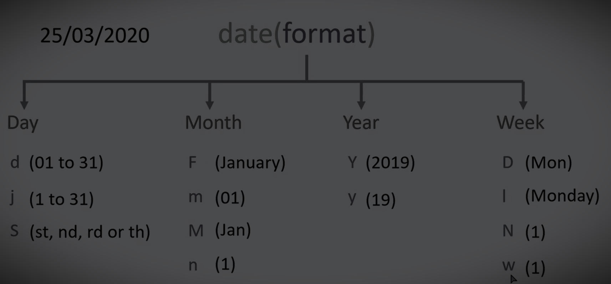
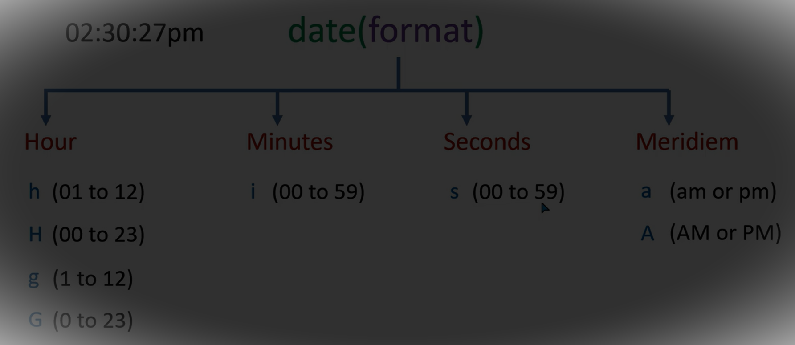

# Learningphp

<code></code>

* This repository git clone 
### `https://github.com/vckindarkhediya/Learningphp.git`

[echo & print]("https://github.com/vckindarkhediya/Learningphp/blob/php/Day-1-Learning/index.php" "Learning Php")

* Day-1-Learn <a href ="https://github.com/vckindarkhediya/Learningphp/blob/php/Day-1-Learning/index.php">echo & print </a> 
* Day-2-Learn <a href ="https://github.com/vckindarkhediya/Learningphp/blob/php/Day-2-Learning/index.php">variable declaration </a> 
* Day-3-Learn <a href ="https://github.com/vckindarkhediya/Learningphp/blob/php/Day-3-Learning/index.php">data types</a> 
* Day-4-Learn <a href ="https://github.com/vckindarkhediya/Learningphp/blob/php/Day-4-Learning/index.php">comments</a> 
* Day-5-Learn <a href ="https://github.com/vckindarkhediya/Learningphp/blob/php/Day-5-Learning/index.php">define global variable</a> 
* Day-6-Learn <a href ="https://github.com/vckindarkhediya/Learningphp/blob/php/Day-6-Learning/index.php">arithmetic operator</a> 
* Day-7-Learn <a href ="https://github.com/vckindarkhediya/Learningphp/blob/php/Day-7-Learning/index.php">assigment operator</a> 
* Day-8-Learn <a href ="https://github.com/vckindarkhediya/Learningphp/blob/php/Day-8-Learning/index.php">comparison operator</a> 
* Day-9-Learn <a href ="https://github.com/vckindarkhediya/Learningphp/blob/php/Day-9-Learning/index.php">if else statement</a> 
* Day-10-Learn <a href ="https://github.com/vckindarkhediya/Learningphp/blob/php/Day-10-Learning/index.php">logical operator</a> 
* Day-11-Learn <a href ="https://github.com/vckindarkhediya/Learningphp/blob/php/Day-11-Learning/index.php">conditional ternary operator</a> 
* Day-12-Learn <a href ="https://github.com/vckindarkhediya/Learningphp/blob/php/Day-12-Learning/index.php">string operator</a> 
* Day-13-Learn <a href ="https://github.com/vckindarkhediya/Learningphp/blob/php/Day-13-Learning/index.php">if elseif statement</a> 
* Day-14-Learn <a href ="https://github.com/vckindarkhediya/Learningphp/blob/php/Day-14-Learning/index.php">switch case statement</a> 
* Day-15-Learn <a href ="https://github.com/vckindarkhediya/Learningphp/blob/php/Day-15-Learning/index.php">while loop</a> 
* Day-16-Learn <a href ="https://github.com/vckindarkhediya/Learningphp/blob/php/Day-16-Learning/index.php">do while loop</a> 
* Day-17-Learn <a href ="https://github.com/vckindarkhediya/Learningphp/blob/php/Day-17-Learning/index.php">for loop</a> 
* Day-18-Learn <a href ="https://github.com/vckindarkhediya/Learningphp/blob/php/Day-18-Learning/index.php">nested loop</a> 
* Day-19-Learn <a href ="https://github.com/vckindarkhediya/Learningphp/blob/php/Day-19-Learning/index.php">break & continue statement</a> 
* Day-20-Learn <a href ="https://github.com/vckindarkhediya/Learningphp/blob/php/Day-20-Learning/index.php">goto statement</a> 
* Day-21-Learn <a href ="https://github.com/vckindarkhediya/Learningphp/blob/php/Day-21-Learning/index.php">php function</a> 
* Day-22-Learn <a href ="https://github.com/vckindarkhediya/Learningphp/blob/php/Day-22-Learning/index.php">php function paramaters</a> 
* Day-23-Learn <a href ="https://github.com/vckindarkhediya/Learningphp/blob/php/Day-23-Learning/index.php">php function with return values</a> 
* Day-24-Learn <a href ="https://github.com/vckindarkhediya/Learningphp/blob/php/Day-24-Learning/index.php">php functions arguments by reference</a> 
* Day-25-Learn <a href ="https://github.com/vckindarkhediya/Learningphp/blob/php/Day-25-Learning/index.php">php variable function </a> 
* Day-26-Learn <a href ="https://github.com/vckindarkhediya/Learningphp/blob/php/Day-26-Learning/index.php">php recursive function </a> 
* Day-27-Learn <a href ="https://github.com/vckindarkhediya/Learningphp/blob/php/Day-27-Learning/index.php">php global & local variables</a> 
* Day-28-Learn <a href ="https://github.com/vckindarkhediya/Learningphp/blob/php/Day-28-Learning/index.php">php array</a> 
* Day-29-Learn <a href ="https://github.com/vckindarkhediya/Learningphp/blob/php/Day-29-Learning/index.php">php associative array</a> 
* Day-30-Learn <a href ="https://github.com/vckindarkhediya/Learningphp/blob/php/Day-30-Learning/index.php">php multidimensional array</a> 
* Day-31-Learn <a href ="https://github.com/vckindarkhediya/Learningphp/blob/php/Day-31-Learning/index.php">php multidimensional associative array</a> 
* Day-32-Learn <a href ="https://github.com/vckindarkhediya/Learningphp/blob/php/Day-32-Learning/index.php">php count() & Sizeof() </a> 
* Day-33-Learn <a href ="https://github.com/vckindarkhediya/Learningphp/blob/php/Day-33-Learning/index.php">php in_array() & array_search()</a> 
* Day-34-Learn <a href ="https://github.com/vckindarkhediya/Learningphp/blob/php/Day-34-Learning/index.php">php array_replace() & array_replace_recurvise</a> 
* Day-35-Learn <a href ="https://github.com/vckindarkhediya/Learningphp/blob/php/Day-35-Learning/index.php">php array_pop() & array_push</a> 
* Day-36-Learn <a href ="https://github.com/vckindarkhediya/Learningphp/blob/php/Day-36-Learning/index.php">php array_shift() & array_unshift()</a> 
* Day-37-Learn <a href ="https://github.com/vckindarkhediya/Learningphp/blob/php/Day-37-Learning/index.php">php array_merge() & array_combine()</a> 
* Day-38-Learn <a href ="https://github.com/vckindarkhediya/Learningphp/blob/php/Day-38-Learning/index.php">php array_slice()</a> 
* Day-39-Learn <a href ="https://github.com/vckindarkhediya/Learningphp/blob/php/Day-39-Learning/index.php">php array_splice()</a> 
* Day-40-Learn <a href ="https://github.com/vckindarkhediya/Learningphp/blob/php/Day-40-Learning/index.php">php array_key() & array_intersect()</a> 
* Day-41-Learn <a href ="https://github.com/vckindarkhediya/Learningphp/blob/php/Day-41-Learning/index.php">php array_diff() & array_udiff()</a> 
* Day-42-Learn <a href ="https://github.com/vckindarkhediya/Learningphp/blob/php/Day-42-Learning/index.php">php date()</a> 
* Day-43-Learn <a href ="https://github.com/vckindarkhediya/Learningphp/blob/php/Day-43-Learning/index.php">php time()</a> 
* Day-44-Learn <a href ="https://github.com/vckindarkhediya/Learningphp/blob/php/Day-44-Learning/index.php">php mktime() & gmmktime()</a> 
* Day-45-Learn <a href ="https://github.com/vckindarkhediya/Learningphp/blob/php/Day-45-Learning/index.php">php date_create() & date_formate() </a> 
* Day-46-Learn <a href ="https://github.com/vckindarkhediya/Learningphp/blob/php/Day-46-Learning/index.php">php date_checkdate() & date_diff() </a> 
* Day-47-Learn <a href ="https://github.com/vckindarkhediya/Learningphp/blob/php/Day-47-Learning/index.php">php date_add(), date_sub() & add_modify() </a> 
* Day-48-Learn <a href ="https://github.com/vckindarkhediya/Learningphp/blob/php/Day-48-Learning/index.php">php getdata(), localtime() & gettimeofday() </a> 
* Day-49-Learn <a href ="https://github.com/vckindarkhediya/Learningphp/blob/php/Day-49-Learning/index.php">php date_parse() & date_parse_from_formate()</a> 
* Day-50-Learn <a href ="https://github.com/vckindarkhediya/Learningphp/blob/php/Day-50-Learning/index.php">php strtotime() & strftime()</a> 
* Day-51-Learn <a href ="https://github.com/vckindarkhediya/Learningphp/blob/php/Day-51-Learning/index.php">php date_time_set()</a> 
* Day-52-Learn <a href ="https://github.com/vckindarkhediya/Learningphp/blob/php/Day-52-Learning/index.php">php timezone()</a> 
* Day-53-Learn <a href ="https://github.com/vckindarkhediya/Learningphp/blob/php/Day-53-Learning/index.php">php include & require statement</a> 
